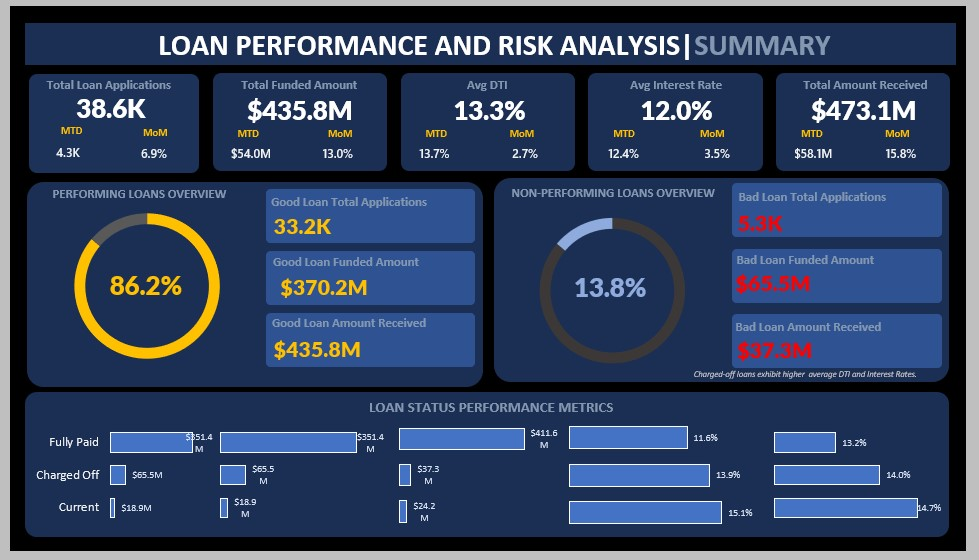

## Hi there, I'm Godwin Deborah 👋

  

  
 
  

## 🚀 About Me

Hi, I'm Debbie — a Data Analyst passionate about transforming raw data into actionable business insights.

I enjoy working with complex datasets, uncovering meaningful patterns, and translating findings into clear, data-driven recommendations. My experience spans analytics projects across banking, retail, logistics, healthcare, and digital marketing, where I've built dashboards, automated reporting processes, and delivered insights that support business decision-making.

Beyond dashboards and SQL queries, I'm interested in understanding the business problems behind the data. I focus on creating solutions that help organizations monitor performance, improve efficiency, and make informed decisions with confidence.

My background in IT and cloud support gives me a strong understanding of how data flows through systems and the infrastructure that supports analytics. This perspective helps me bridge the gap between technical implementation and business value.

When I'm not analyzing data, I enjoy creating content, mentoring others, and reading.

# 🌟My Projects

## 📊 Excel | Bank Loan Performance Dashboard

A loan portfolio analytics dashboard built in Excel to monitor lending performance, repayment trends, borrower risk, and portfolio quality. The project combines data cleaning, KPI development, and interactive reporting to support informed lending decisions.

  

  

---

## 🛠️ Technical Skillset

### Data Analysis & Visualization

  
  
  
  

### Data Management & Modeling

  
  
  
  

### Business Intelligence & Analytics

  
  
  
  

## 📫 Let's Connect

  

