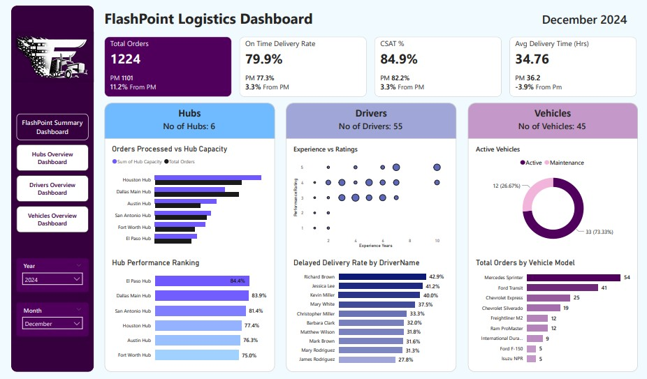
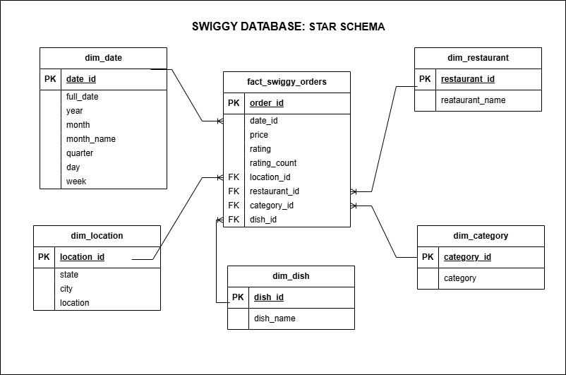

## Hi there, I'm Godwin Deborah 👋

  

  
 
  

## 🚀 About Me

Hi, I'm Debbie — a Data Analyst passionate about transforming raw data into actionable business insights.

I enjoy working with complex datasets, uncovering meaningful patterns, and translating findings into clear, data-driven recommendations. My experience spans analytics projects across banking, retail, logistics, healthcare, and digital marketing, where I've built dashboards, automated reporting processes, and delivered insights that support business decision-making.

Beyond dashboards and SQL queries, I'm interested in understanding the business problems behind the data. I focus on creating solutions that help organizations monitor performance, improve efficiency, and make informed decisions with confidence.

My background in IT and cloud support gives me a strong understanding of how data flows through systems and the infrastructure that supports analytics. This perspective helps me bridge the gap between technical implementation and business value.

When I'm not analyzing data, I enjoy creating content, mentoring others, and reading.

# 🌟 Featured Projects

## 📊 Excel | Bank Loan Performance Dashboard

A loan portfolio analytics dashboard built in Excel to monitor lending performance, repayment trends, borrower risk, and portfolio quality. The project combines data cleaning, KPI development, and interactive reporting to support informed lending decisions.

  

  

---

## 📈 Power BI | Flashpoint Logistics Dashboard

An end-to-end Business Intelligence solution built in Power BI to analyze last-mile delivery operations. The dashboard integrates orders, hubs, drivers, and fleet data to monitor delivery performance, identify operational bottlenecks, and support data-driven logistics decision-making through interactive KPI tracking and performance analysis.
s.

  

  

---

## 📉 Tableau | Human Resources Dashboard

An interactive Tableau dashboard designed to analyze workforce composition, employee demographics, compensation trends, and organizational performance. The solution enables HR teams and business stakeholders to monitor workforce growth, explore employee distribution, and uncover insights that support data-driven workforce planning and decision-making.

  

  

---

## 🗄️ SQL | Swiggy Performance Analysis

A SQL-based analytics solution built to clean, model, and analyze food delivery data for business reporting and decision support. The project demonstrates data validation, ETL pipeline development, star schema design, and analytical querying to generate insights across revenue, customer demand, restaurant performance, and location-based trends.

  

  

---

## 📂 Additional Projects

* Call Center Dashboard
* Car Sales Dashboard
* Blinkit Analysis
* Employee Management System
* Healthcare Dashboard *(In Progress)*
* Data Warehouse Project *(In Progress)*

## 🛠️ Technical Skillset
#### Data Analysis & Visualization

  
  
  
  

#### Business Intelligence & Analytics

  
  
  
  

